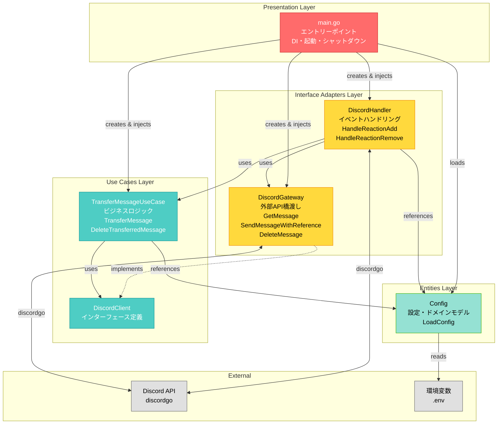

# Reaction Bot - アーキテクチャ

## アーキテクチャ図



## レイヤー責務

### Presentation Layer
- **main.go**: エントリーポイント、依存関係の注入（DI）、Bot起動・シャットダウン

### Interface Adapters Layer
- **DiscordHandler (handlers/)**: 入力側アダプター - Discordイベントのハンドリング、UseCaseの呼び出し
- **DiscordGateway (gateways/)**: 出力側アダプター - 外部API（discordgo）との橋渡し

### Use Cases Layer
- **TransferMessageUseCase**: メッセージ転送のビジネスロジック
- **DiscordClient**: Discord API通信のインターフェース定義
- **重要**: 外部ライブラリ（discordgo）に直接依存しない

### Entities Layer
- **Config**: 設定とドメインモデル、環境変数の読み込みとバリデーション

## 依存関係の方向

```
Presentation → Interface Adapters → Use Cases → Entities
                (handlers, gateways)
```

### クリーンアーキテクチャの原則
- 各レイヤーは内側のレイヤーのみに依存
- UseCasesは**インターフェース**のみ定義、Gatewaysが**実装**
- HandlersとGatewaysは同じInterface Adapters層（同等の立場）
- Handlersがビジネスフローを統制（orchestrate）、Gatewaysを呼び出す