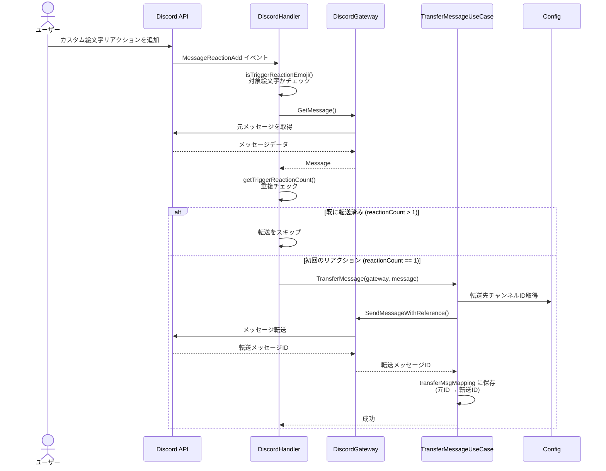
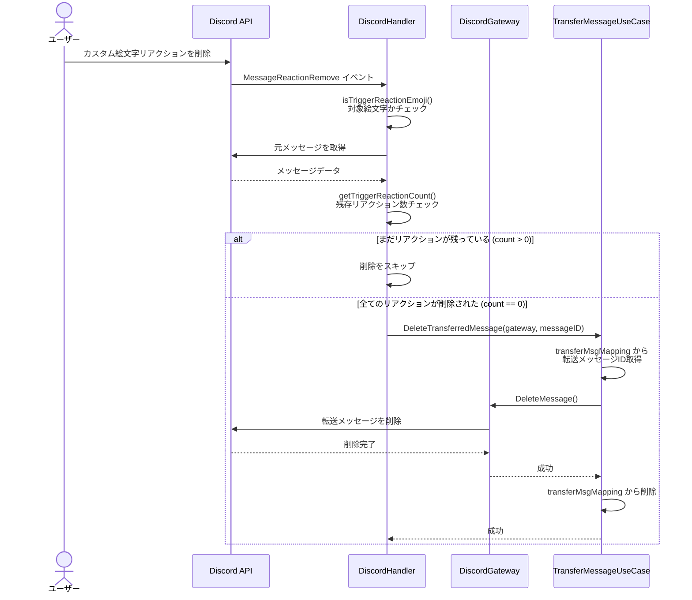

# Reaction Bot - 処理フロー

## リアクション追加時のフロー



### 処理の流れ

1. **イベント受信**: ユーザーがメッセージにカスタム絵文字リアクションを追加
2. **絵文字チェック**: 設定されたトリガー絵文字かどうかを判定
3. **メッセージ取得**: リアクションされた元メッセージを取得
4. **重複チェック**: 既に同じリアクションが付いているかカウントで判定
   - カウント > 1: 既に転送済みなのでスキップ
   - カウント == 1: 初回のリアクションなので転送処理を実行
5. **メッセージ転送**: 指定チャンネルにメッセージを転送
6. **マッピング保存**: 元メッセージID → 転送メッセージID をメモリに保存

## リアクション削除時のフロー



### 処理の流れ

1. **イベント受信**: ユーザーがメッセージからカスタム絵文字リアクションを削除
2. **絵文字チェック**: 設定されたトリガー絵文字かどうかを判定
3. **メッセージ取得**: リアクションが削除された元メッセージを取得
4. **残存チェック**: 同じリアクションがまだ残っているかカウントで判定
   - カウント > 0: まだリアクションが残っているので削除をスキップ
   - カウント == 0: 全てのリアクションが削除されたので転送メッセージを削除
5. **マッピング検索**: 保存されている元メッセージID → 転送メッセージID を取得
6. **メッセージ削除**: 転送先チャンネルから転送メッセージを削除
7. **マッピング削除**: メモリから元メッセージID → 転送メッセージID を削除

## 重複防止の仕組み

### 転送の重複防止

同じメッセージに複数人が同じリアクションをつけた場合：

```
メッセージA に👍リアクション
├─ ユーザー1が追加 → reactionCount = 1 → 転送実行 ✓
├─ ユーザー2が追加 → reactionCount = 2 → スキップ
└─ ユーザー3が追加 → reactionCount = 3 → スキップ
```

### 削除の重複防止

複数人のリアクションが段階的に削除された場合：

```
メッセージA の👍リアクション削除
├─ ユーザー3が削除 → reactionCount = 2 → スキップ
├─ ユーザー2が削除 → reactionCount = 1 → スキップ
└─ ユーザー1が削除 → reactionCount = 0 → 転送メッセージ削除 ✓
```

最後のリアクションが削除された時のみ、転送メッセージが削除されます。